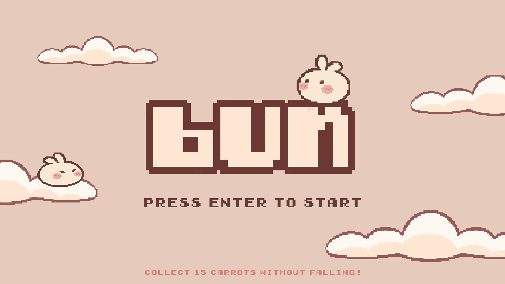
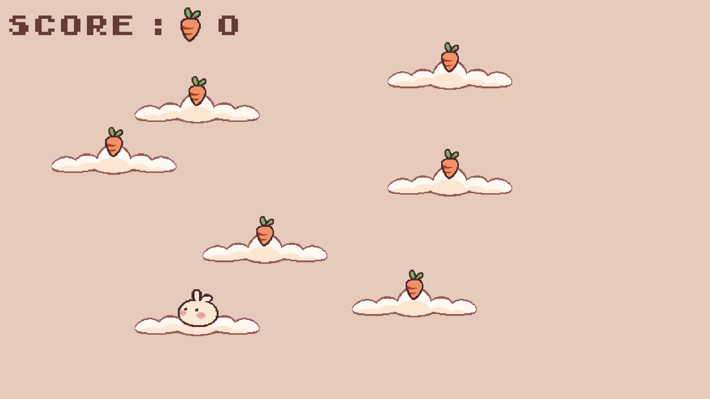
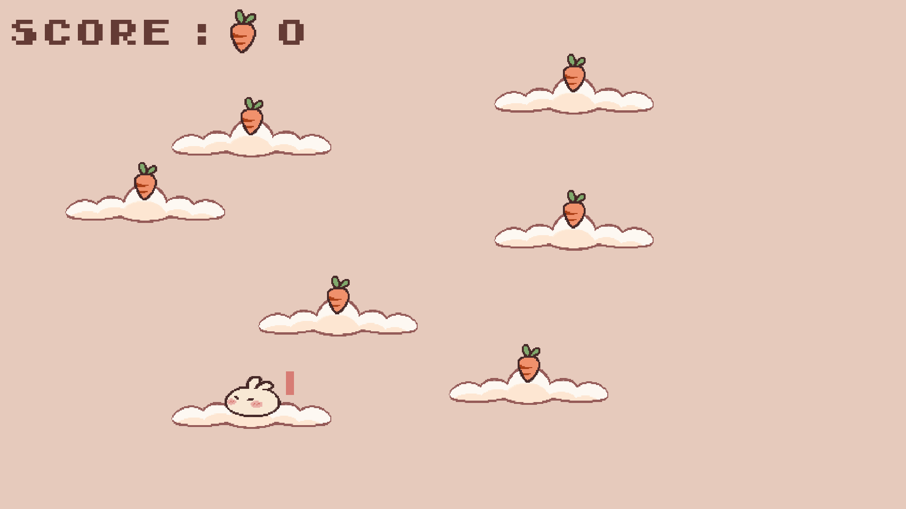
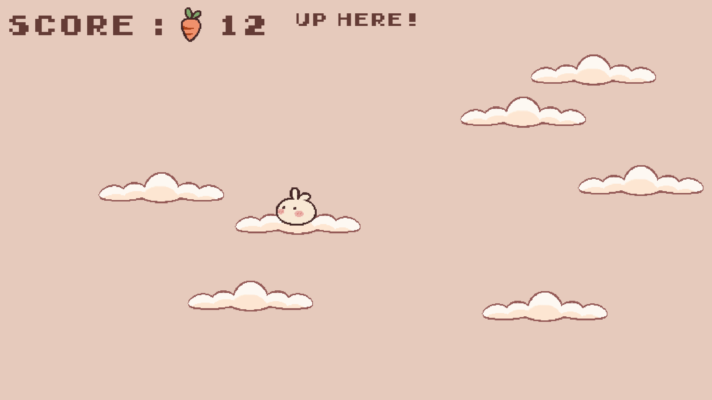
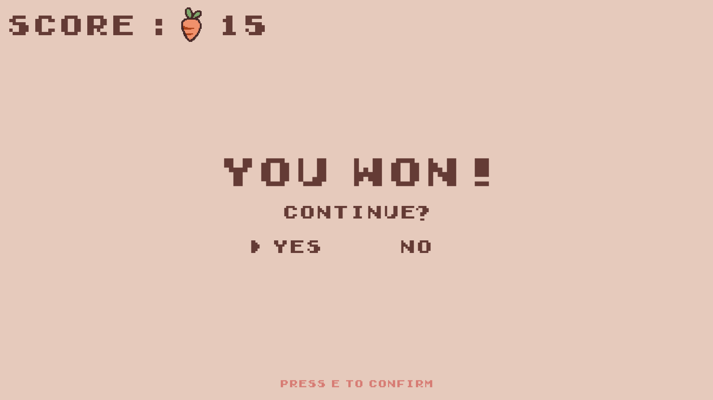
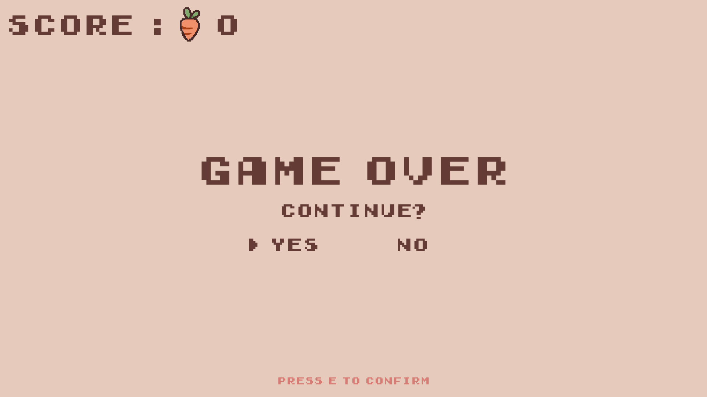

# About the project

Bun is a simple jumping game developed in C++ with the SFML library. 
It was a way for me to practice developing in C++ (which I am new to), producing clean and documented code, and designing pixel art assets.

# How to install?
You simply need to clone or download this repository, and run the `bun.exe` file. 
If you are using an IDE, you can also run the `main` function from there.

:warning: Make sure not to move the files around, otherwise the `bun.exe` file 
might not be able to find the `asset` folder that contains necessary sprites and text fonts.

# How to play?

## :warning: Known issue
At the moment, the duration of game loops that process events and render the game is dependent on the machine.
If you have a machine that is significantly faster or slower than mine, you might experience major issues such as the bunny not being able to jump high enough to reach platforms.

This issue could be fixed by implementing fixed time steps as described in [this article](https://subscription.packtpub.com/book/game+development/9781849696845/1/ch01lvl1sec11/game-loops-and-frames).
However, I won't be fixing the issue for now since this game is just a small personal project that I don't plan on spending more time on.
Feel free to suggest a fix if that's something you're interested in!

## Gameplay

You play as a bunny that can jump up to collect carrots. 
The goal of the game is to collect 15 carrots without falling through a maximum of 2 screens.

  

When you are on the title screen, press the `Enter` key to start playing.

     
    

You can move around using the arrow keys, and press the `Space` bar to charge a jump. 
The longer you charge (up to a certain limit), the higher the bunny will jump when you release the `Space` bar.
The progress of your charge is indicated by a pink bar next to the bunny.

  

If you go up and leave the current screen, a new screen with new platforms and carrots will be generated.
A prompt will remind you to go up when you have collected all the carrots on the current screen.

    
    

You win if you manage to collect 15 carrots, but you lose if you fall through a maximum of 2 screens. 
In both case, you will be prompted to choose between starting a new game or going back to the title screen.
Press `E` to confirm your choice.

# Have fun! :rabbit2: